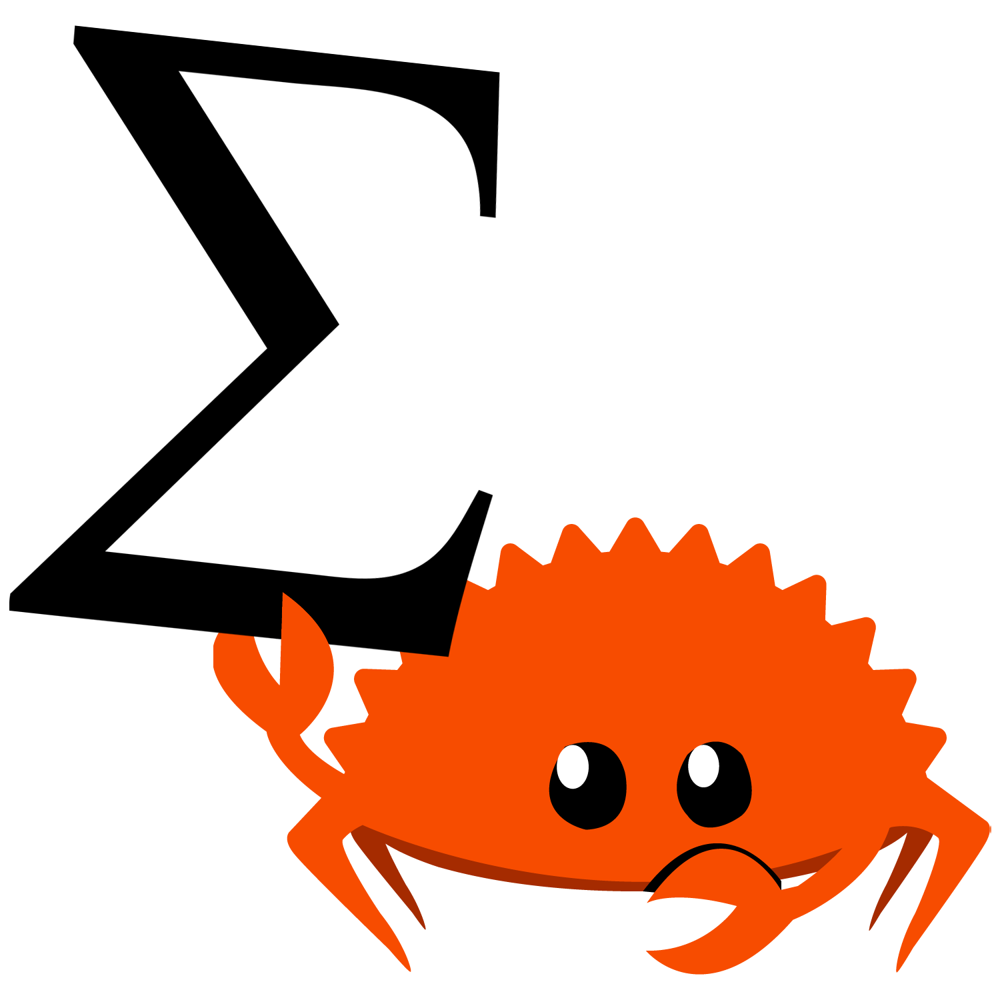

 

## Hello!

Welcome to the official site of **mathrs**! Here you can find all of the useful resources for you to get started!

- [Getting Started](GETTING_STARTED.md)

If you are already using mathrs in your project, you can check other useful resources like:

- [Cookbook](COOKBOOK.md)
- [Examples](EXAMPLES.md)

And, if you want to get tuned into the development and future goals of this project, you can check out the:

- [Roadmap](ROADMAP.md)

## License
mathrs is provided under the MIT license. See [LICENSE](LICENSE). These files may not be copied, modified, or distributed except according to those terms.